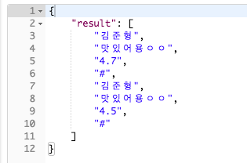

#  DssertMatzzip_Server
=============

### API 문서 : [Google docs로 이동](https://docs.google.com/document/d/1K3fzN_OUAdnAGoy0OsK1ejsdH4eCdTpa25JWxrYZ6W8/edit)

-----------------

# file structure

- dessertServer : django project

- login : 로그인에 관한 app

- join : 회원 가입에 관한 app

- store : 가게점포에 관한 app

- user : 회원 정보에 관한 app

- login : 회원 로그인을 위한 앱(페이스북, 카카오톡 연동로그인 + 자체로그인)

- join : 회원가입과 회원정보 수정을 위한 앱

- screenshots : 진행상황을 표시하기 위한 이미지 저장 폴더

-----------------

# 진행상황
## 2018.07.26
> - django REST Framework 설치 및 테스트 케이스 동작확인
> > 

## 2018.07.31
> - facebook login을 위한 API문서 생산
> > 

## 2018.08.02
> - 외부 ini파일을 통한 DB setting을 gitignore
> - django project models class --> DB 구축 테스트 확인
> > 

## 2018.08.09
> - 로그인 api 문서 및 구현완료 (카카오톡, 페이스북 accesstoken->db확인)
> - accesstoken이 db에 있으면 signin_req / 없으면 signup_req 반환
> > 
> - 앱에서 카카오톡 로그인 url로 post 테스트 확인
> > 

## 2018.08.13
> - 회원가입 api 문서 작성중
> > 

## 2018.08.14
> - 회원가입, 회원정보수정 api 문서 완료
> - 회원가입, 정보수정을 위한 app 'join' 생성
> > 
> - app 'join'에서 app 'login'의 User table 접근 및 값 INSERT 확인
> > 

## 2018.08.17
> - join앱 내 소셜, 자체 회원가입 함수 구현
> - 회원정보 수정 함수 구현(DB갱신)
> > 

## 2018.08.18
> - 스토리보드 기반으로 기능 추려내기

## 2018.08.27
> - 추려낸 기능 -> api문서 구현
> - 가게 데이터 파트, 랭킹파트, 소셜기능 파트 api문서 틀 구현 및 urls 경로 설정

## 2018.08.29
> - api문서에 기반하여 필요한 DB 테이블 구축 및 ERD 구성
> > 

## 2018.08.30
> - api 문서 구현중..
> - api 문서에 기반하여 서버 구축중..

## 2018.09.02~09.10
> - database model 필드 추가(스토어 리뷰, 유저 소개란)
> - api 문서 작성완료 (상단 구글독스 링크로 확인가능)
> > 

## 2018.09.21
> - 로그인 파트 - 페이스북, 카카오 완료

## 2018.09.25
> - 로그인 파트 - 자체로그인 완료
> - pwd는 프론트단에서 암호화, 액세스토큰은 서버단에서 난수발생

## 2018.09.27
> - 회원가입 파트 - 자체 회원가입 완료

## 2018.09.29
> - 회원가입 파트 - 소셜(카카오, 페이스북) 회원가입 완료
> - 회원정보 수정 완료(GET:DB내어주기/POST:DB수정)
> > 

## 2018.10.01
> - 회원가입 파트 - 회원검색 수정작업

## 2018.10.03
> - 가게, 랭커, 팔로워, 컬렉션, 가고싶은 가게 전달방식 고안
> - 배열로 전달 (배열 사이 #으로 객체간 구분할 것)

## 2018.10.12
> - 회원가입 파트 - 회원검색 완료
> - 배열로 안드로이드단으로 뿌려주기
> > 

## 2018.10.13
> - 가게 데이터 파트 - 가게 데이터 불러오기 완료
> - order_by() 미적용 문제 발생
> - charField로 리뷰 점수를 받아서 문제가 생긴 것으로 파악

## 2018.10.15
> - 가게 데이터 파트 - 가게 데이터 수정하기 완료(8-a기능으로 통합)
> - api 3-d. 가게가 사라졌어요 기능을 통해 가게 데이터 수정 요청을 받고, 이 요청을 아래와 같이 수정함
> - api 8-a. 가게 추가하기 기능을 이용하여 앱 관리자가 직접 가게 데이터를 수정함

## 2018.10.20
> - 가게 데이터 파트 - 가게 데이터 불러오기 order_by()문제 해결
> - 입력받는 charField값에 "" 미 표기로 해당 문제 발생했음

## 2018.10.22
> - 가게 데이터 파트 - 가게 리뷰저장 완료
> > 

## 2018.10.24
> - 가게 데이터 파트 - 가게가 사라졌어요 요청받기 기능 완료
> - 가게 폐업요청뿐만 아니라 가게 정보 수정 요청 또한 받음
> > 

## 2018.10.16~2018.10.31
> - 랭킹 파트 - 지역별 리뷰어, 지역별 가게 별점순 랭킹 불러오기
> - 소셜 파트 - 팔로우/워, 개인 컬렉션, 가고싶은 가게

## 2018.11.01
> - api 8-b.선택지역 내 가게 리스트 불러오기 기능 추가
> - 추가 기능 파트 - 선택지역 내 가게 리스트 불러오기 완료
> > 

## 2018.11.02
> - 리뷰 삭제를 위해 가게의 리뷰마다 고유id값 출력하도록 수정함
> > 
> - api 8-c. 리뷰 삭제하기 기능 추가
> - 추가 기능 파트 - 리뷰 삭제하기 기능 완료
> > 

-----------------

# 미결사항
- 잘못된 매개변수(실패 시) : error occured 출력하는 것(서비스구현 후 추가)

-----------------
